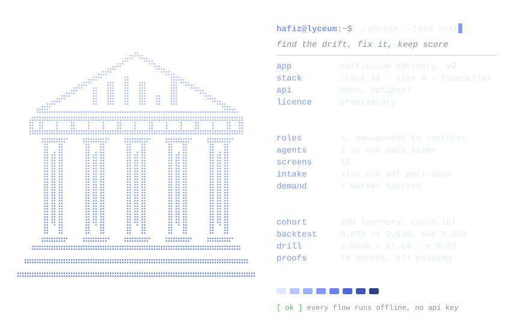
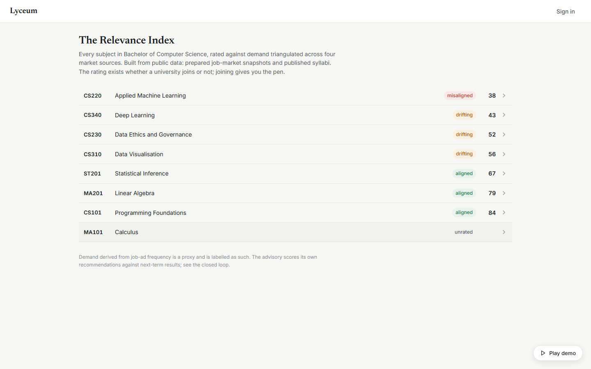
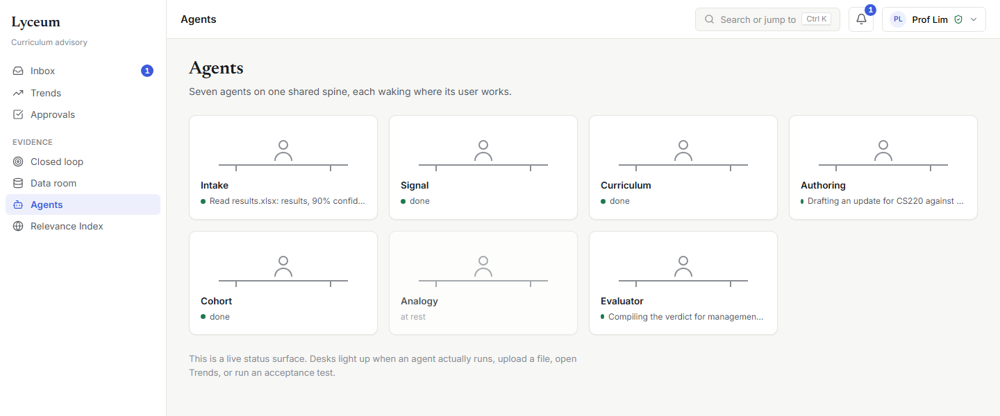
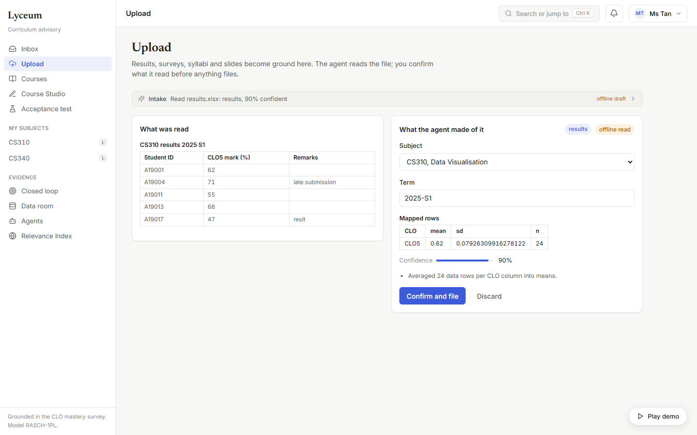
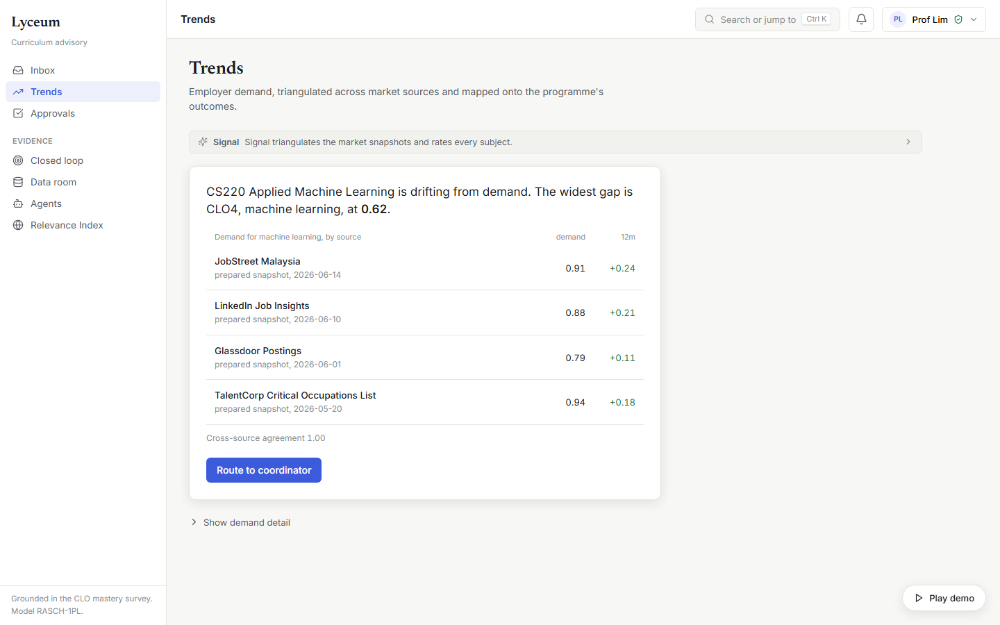
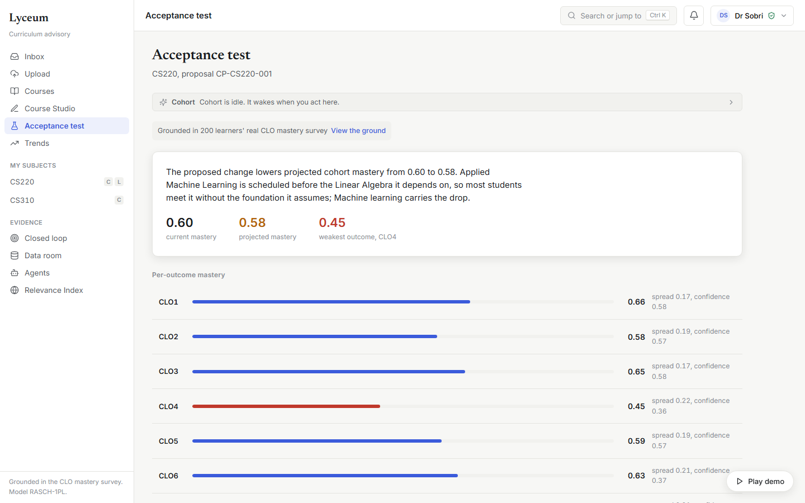
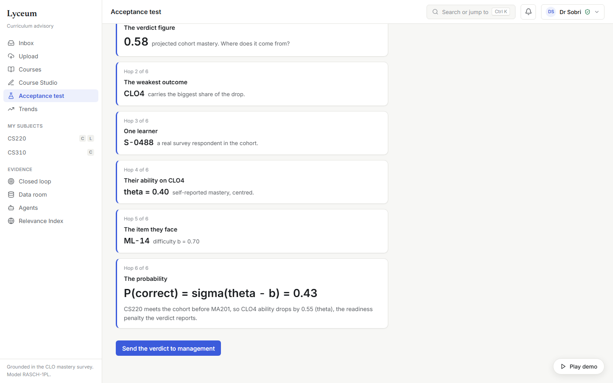
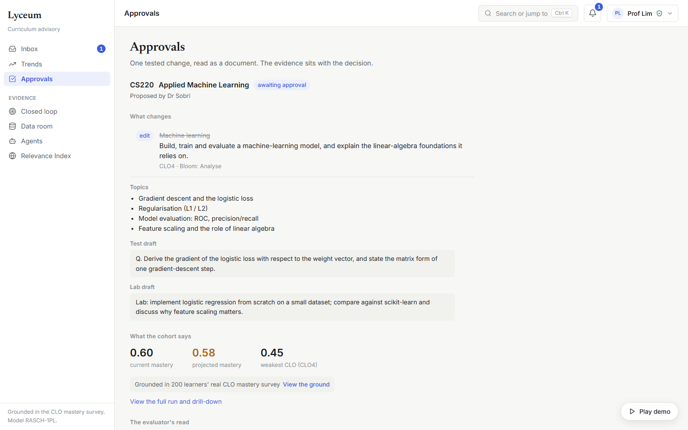
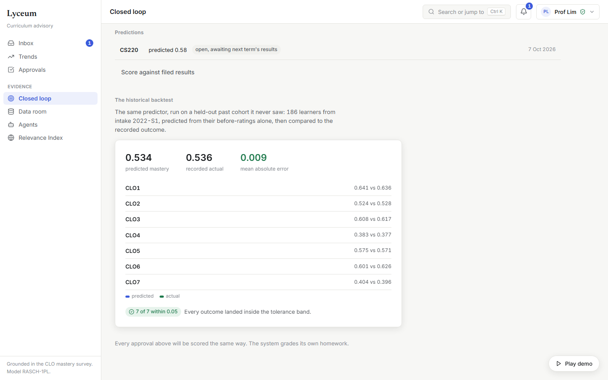

<div align="center">
  <picture>
    <source media="(prefers-color-scheme: dark)" srcset=".github/readme/banner-dark.svg">
    <source media="(prefers-color-scheme: light)" srcset=".github/readme/banner-light.svg">
    
  </picture>
</div>

<div align="center">
  <picture>
    <source media="(prefers-color-scheme: dark)" srcset=".github/readme/card-dark.svg">
    <source media="(prefers-color-scheme: light)" srcset=".github/readme/card-light.svg">
    
  </picture>
</div>

<p align="center">
  <a href="#hafizlyceum-play-demo"></a>
  <a href=".github/readme/shots/closed-loop.png"></a>
  <a href="#hafizlyceum-npm-run-proveall"></a>
</p>

```text
hafiz@lyceum:~$ cat ./about
know which of your courses have drifted from industry demand,
and fix them before your graduates feel it. an advisory layer
that finds the drift, helps the faculty fix it on evidence,
and scores its own advice against the next term's results.

hafiz@lyceum:~$ npm run prove:all | grep passed
12 passed, 0 failed.
4 passed, 0 failed.
28 passed, 0 failed.
12 passed, 0 failed.
18 passed, 0 failed.
```

### <samp>hafiz@lyceum:~$ cat ./problem</samp>

A university has no independent, data-grounded way to know which of its courses
have drifted from industry demand until its graduates fail to get hired.
Curricula are reviewed on 3-to-5-year accreditation cycles while the market
reprices skills every 12 to 18 months. Lyceum is the missing mechanism: an
advisory layer that detects the drift, localises it to specific courses, helps
the faculty fix it on evidence, and then scores its own advice against the next
term's real results.

| pillar | what it means |
|:--|:--|
| **Demand truth** | Skill demand triangulated across four market sources (JobStreet, LinkedIn, Glassdoor, the TalentCorp Critical Occupations List), never a single feed. Every claim carries its receipts and a cross-source agreement level; when sources disagree, the UI says so. |
| **Supply truth** | What a course teaches is read from published documents (the official syllabus pdf, real results files), not self-reported forms. Coordinators are verified; unverified edits are labelled. |
| **Grounded remediation** | Every proposed change is stress-tested against a measured cohort of 200 real learners on a Rasch 1PL psychometric model before anyone commits. Every number traces to a learner and an item: the worked example lands on learner S-0488, item ML-14, P(correct) = 0.43. |
| **Self-scoring** | Approving a change records a prediction; next term's uploads score it. The same predictor, backtested on a held-out cohort it never saw: predicted 0.534 against a real 0.536, mean error 0.009. |

### <samp>hafiz@lyceum:~$ open ./relevance-index</samp>

<p align="center">
  
</p>

The public wedge is the **Relevance Index**: every subject rated against
demand, built from public data, reachable without signing in. The rating exists
whether a university joins or not; joining gives the university the pen.

### <samp>hafiz@lyceum:~$ ls ./agents</samp>

Four roles work in it (management, department, coordinator, lecturer), each
with a calm, task-first workspace. Home is an inbox: what needs you now,
nothing else. Seven agents sit on one shared data spine and wake where the
user works:

| agent | does |
|:--|:--|
| Intake | Reads any dropped file (xlsx, csv, pdf, pptx, docx) and shows what it read before anything files |
| Signal | Triangulates the market |
| Curriculum | Reasons over the prerequisite graph |
| Authoring | Drafts and critiques |
| Cohort | Runs the acceptance test |
| Analogy | Grounds brand-new subjects in similar courses |
| Evaluator | Compiles the verdict for the gate |

<p align="center">
  
</p>

### <samp>hafiz@lyceum:~$ ./play-demo</samp>

One **Play demo** control (bottom right) plays the entire storyline over the
real app: a lecturer files real documents through the actual parse pipeline,
management routes the drift the Signal agent finds, the coordinator drafts the
fix with the Authoring agent assisting and builds the test in the assessment
studio, the Cohort agent stress-tests it live on screen, management approves
with the evidence attached, and the closed loop records the prediction. A
simulated cursor performs every step with human pacing; nothing is mocked.
Press record, click Play once. The screens below are that same loop, shot from
a local build with no api server and no key.

<table>
  <tr>
    <td width="50%"><samp>1. intake: what was read, what it made of it</samp></td>
    <td width="50%"><samp>2. trends: four sources, one gap</samp></td>
  </tr>
  <tr>
    <td></td>
    <td></td>
  </tr>
  <tr>
    <td><samp>3. acceptance test: the cohort's verdict</samp></td>
    <td><samp>4. drill-down: one learner, one item</samp></td>
  </tr>
  <tr>
    <td></td>
    <td></td>
  </tr>
  <tr>
    <td><samp>5. approvals: the change as a document</samp></td>
    <td><samp>6. closed loop: it grades its own homework</samp></td>
  </tr>
  <tr>
    <td></td>
    <td></td>
  </tr>
</table>

### <samp>hafiz@lyceum:~$ npm run dev</samp>

Requirements: Node.js 22.2+ (24 recommended) and a modern browser.

```bash
npm install
npm run dev        # web app on http://localhost:5173 + api on :8787
npm run build      # production build into dist/
npm run preview    # serve the build (app runs fully without the api server)
npm run typecheck  # tsc --noEmit
```

Live agents are optional. Copy `.env.example` to `.env` and add an
`ANTHROPIC_API_KEY` to make the five LLM agents (Intake, Signal, Authoring,
Analogy, Evaluator) call Claude with streaming; without a key every flow still
works on the deterministic offline path, labelled honestly as such in the UI.
The Cohort and Curriculum agents are real computation either way and never call
a model.

### <samp>hafiz@lyceum:~$ npm run prove:all</samp>

The maths, the flows, and the intake pipeline are covered by deterministic
proof scripts (no UI, no network):

```bash
npm run prove          # the spine and the canonical numbers (12 checks)
npm run prove:backtest # the closed-loop backtest (4 checks)
npm run prove:flow     # store, roles, state machine, analogy, closed loop (28 checks)
npm run prove:signal   # the staged Signal reveal (12 checks)
npm run prove:intake   # every demo file parses, interprets, files (18 checks)
npm run prove:all      # all of the above (74 checks)
```

Headless verification of the built app:

```bash
npm run build
node scripts/walk.mjs  # sign in, visit every screen, file a real upload, assert no errors
npm run smoke          # play the whole self-driving demo, assert the end state
```

### <samp>hafiz@lyceum:~$ cat ./JUDGES.md</samp>

**[JUDGES.md](JUDGES.md)** is the five-minute guide: a hands-off path (one
click, the app performs its whole storyline) and a hands-on path (the same
loop, your clicks), plus what is worth poking. The full as-built document
(problem statement, objectives, positioning, validation) is
**[lyceum-v3-as-built.md](lyceum-v3-as-built.md)**, and the calls made during
the build are in **[DECISIONS.md](DECISIONS.md)**.

### <samp>hafiz@lyceum:~$ tree -L 2</samp>

```text
server/               the thin api: /api/parse (5 formats) + /api/agent (streaming, fallback)
public/demo/          real sample files: results.xlsx, clo-survey.csv, syllabus.pdf, lecture-slides.pptx
src/
  types.ts            the Layer 0 data contract
  theme/              tokens + global styles (one system, no ad-hoc styling)
  lib/spine/          the audited Rasch spine (pure maths, reused from v2 byte-identical)
  data/               seed, cohorts, items, the multi-source market snapshots
  agents/             the seven agents: client wrappers, local interpreters, fixtures
  app/                store (persistent), roles, staged simulations
  ui/                 primitives, shell (sidebar, palette, agent panel), 15 screens
  demo/               the self-driving demo (script, runner, overlay)
scripts/              generators and headless verification
```

### <samp>hafiz@lyceum:~$ ls ../lyceum*</samp>

| version | repo | what it is |
|:--|:--|:--|
| v3 | `hafizmnazman/lyceum` (this repo) | The curriculum advisory: multi-source demand, real document intake, the public Relevance Index and the self-scoring loop |
| v2 | [`hafizmnazman/lyceum-v2`](https://github.com/hafizmnazman/lyceum-v2) | The role-aware, multi-agent decision system over the Rasch 1PL spine that v3 carries byte-identical |

### <samp>hafiz@lyceum:~$ cat ./LICENSE</samp>

Copyright (c) 2026 Hafiz Azman. All rights reserved. Proprietary software; see
[LICENSE](LICENSE).

<sub>The banner and card are generated by <code>.github/readme/build.py</code> (standard library Python). Change a value at the top and run it again.</sub>
